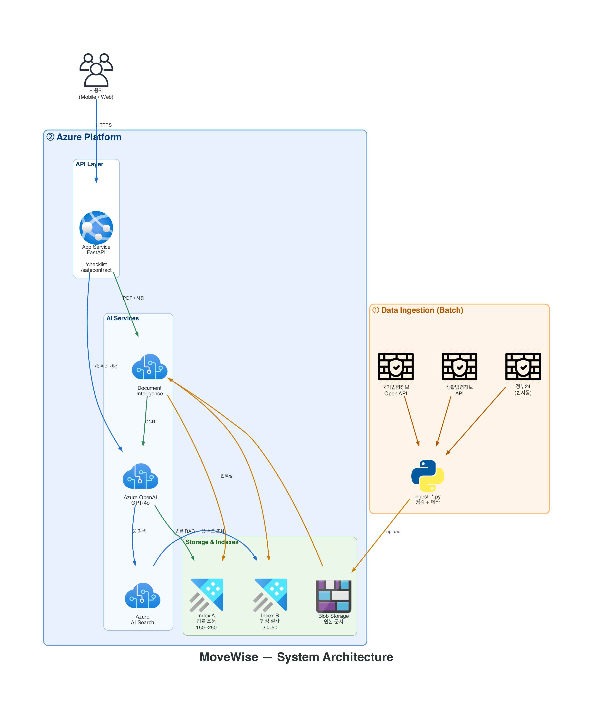

# 03. 시스템 아키텍처



---

## 🧱 구성 영역

### ① Data Ingestion (Batch · 주 1회)

배치로 외부 데이터 소스에서 문서를 수집하여 Azure Storage에 업로드.

| 소스 | 수집 방식 | 상태 |
| --- | --- | --- |
| 국가법령정보 공동활용 API (`open.law.go.kr`) | DRF REST | ⏳ LAW_OC 대기 |
| 찾기쉬운 생활법령정보 (`easylaw.go.kr`) | 웹 스크래핑 | ✅ 53 docs |
| 한국도시가스협회 (`citygas.or.kr`) | 웹 스크래핑 | ✅ 34 회사 / 16 시·도 |
| 공공데이터포털 — 특일정보 (공휴일) | REST API | ✅ 22건 |
| 정부24 | 반자동 | 🔴 JS 렌더링+차단 (easylaw로 대체) |

인제스천 스크립트: `backend/scripts/ingest_*.py`

### ② Azure Platform (Runtime)

#### API Layer
- **App Service**
- **FastAPI** (`backend/app/main.py`)
  - `POST /checklist`
  - `POST /safecontract`
  - `GET /` `/health`

#### AI Services
- **Azure OpenAI (GPT-4o)**
  - Step 1: 사용자 조건 → 검색 쿼리 생성
  - Step 3: 검색 결과 → 체크리스트 구조화
  - SafeContract: 등기부 Structured Output + 쉬운 말 해석
- **Azure AI Search** — 하이브리드 검색 (키워드 + 벡터 + 시맨틱 랭킹)
- **Document Intelligence** — 등기부 PDF/사진 OCR

#### Storage & Indexes
- **Blob Storage** — 원본 문서 저장
- **Index A** (법률 조문) — 150~250 청크 (예정, LAW_OC 이후)
- **Index B** (행정 절차) — **200 청크 확보 완료**

### ③ 사용자 (Mobile / Web)

React Native + Expo 앱 (또는 Streamlit/Web fallback).

---

## 🔄 요청 플로우

### 체크리스트 생성 (`POST /checklist`)

```
사용자 조건 입력
    │
    ▼
[Step 1] LLM → 검색 쿼리 목록 생성
    │   예: ["전입신고", "확정일자 월세", "도시가스 명의변환 분당", ...]
    ▼
[Step 2] AI Search → Index B 검색
    │   각 쿼리당 top 3 청크 retrieval
    │   메타데이터 필터 (region, contract_type)
    ▼
[Step 3] LLM → 체크리스트 구조화
    │   검색된 청크 → 항목·D-day·citation 생성
    ▼
[Step 4] Python → 공휴일 인식 D-day 계산
    │   이사일 기준 실제 날짜 변환
    │   법정 기한 마감일 산출
    ▼
JSON 응답 → 프론트가 타임라인 렌더링
```

### SafeContract 분석 (`POST /safecontract`)

```
등기부 텍스트/PDF 입력
    │
    ▼ (PDF인 경우)
[Document Intelligence] → OCR 텍스트
    │
    ▼
[LLM Structured Output] → {근저당, 가압류, 신탁, 경매} 추출
    │
    ▼
[Python] → 깡통전세 비율 = (근저당 + 보증금) / 시세
    │
    ▼
[AI Search Index A] → 관련 법률 조항 검색
    │
    ▼
[LLM] → 쉬운 말 해석 + 기존 서비스(HUG·인터넷등기소) 안내
    │
    ▼
JSON 응답 (risks[] + referrals[])
```

---

## 🧠 Fallback 전략 (Azure 없을 때)

Azure 리소스가 설정되지 않으면 자동으로 로컬 폴백 모드로 동작합니다:

| 컴포넌트 | Azure 모드 | Fallback 모드 |
| --- | --- | --- |
| 쿼리 생성 | LLM (`build_queries_llm`) | 규칙 기반 (`build_queries_rule_based`) |
| 검색 | Azure AI Search | 로컬 키워드 검색 (`local_search.py` — BM25 lite) |
| 구조화 | LLM Structured Output | 규칙 기반 템플릿 + 청크 메타 overlay |
| 등기부 추출 | LLM Structured Output | 정규식 기반 (`_extract_rule_based`) |
| 해석 생성 | LLM + RAG | 규칙 기반 (`_explain_rule_based`) |

**폴백 모드에서도 200 청크의 실제 데이터를 사용**하여 작동합니다. Golden Query 20건 기준 mean recall 1.000 달성.

---

## 📏 인덱스 규모 감각

| 인덱스 | 예상 문서 | 예상 청크 | 현재 상태 |
| --- | --- | --- | --- |
| Index A (법률) | 법률 8종 (각 30~50조) | 150~250 | ⏳ LAW_OC 대기 |
| Index B (행정 절차) | 33 docs (큐레이션 후) | **200** | ✅ 준비 완료 |
| **합계** | | **350~450 청크** | |

규모가 크지 않아 2주 MVP 내에 충분히 구축 가능.
**핵심은 양이 아니라 메타데이터 설계** (applicable_to · region · contract_type · deadline · related_law)가 검색 품질을 좌우.
